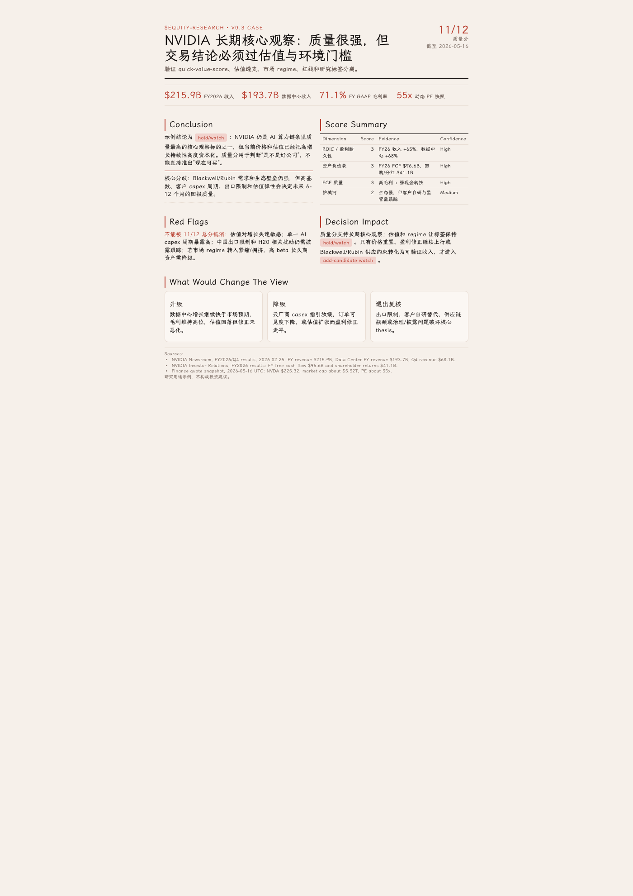
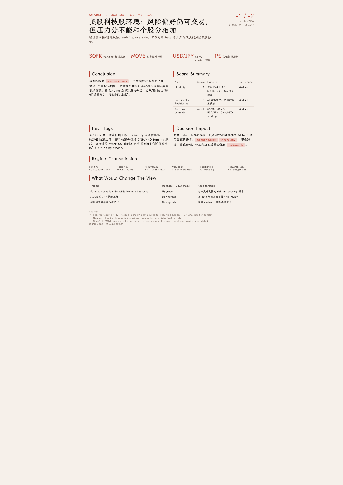
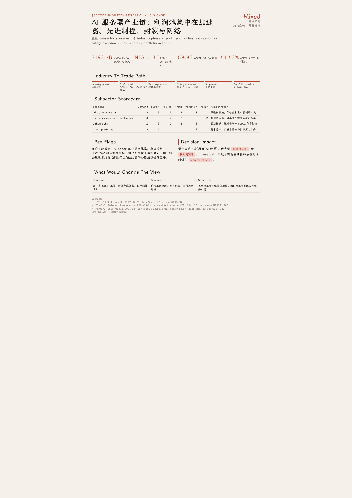
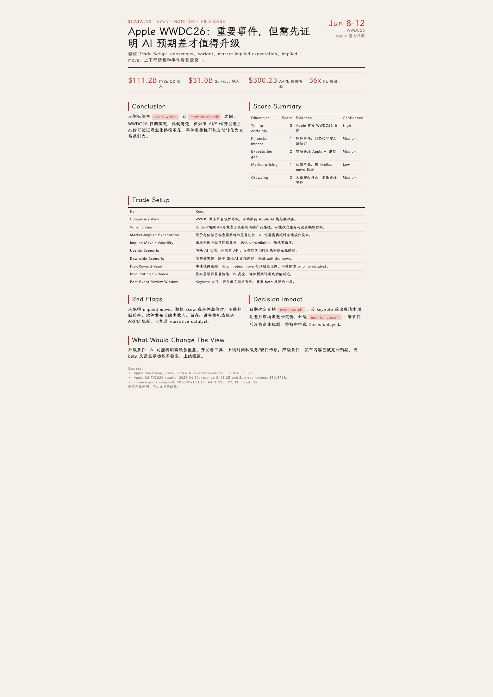
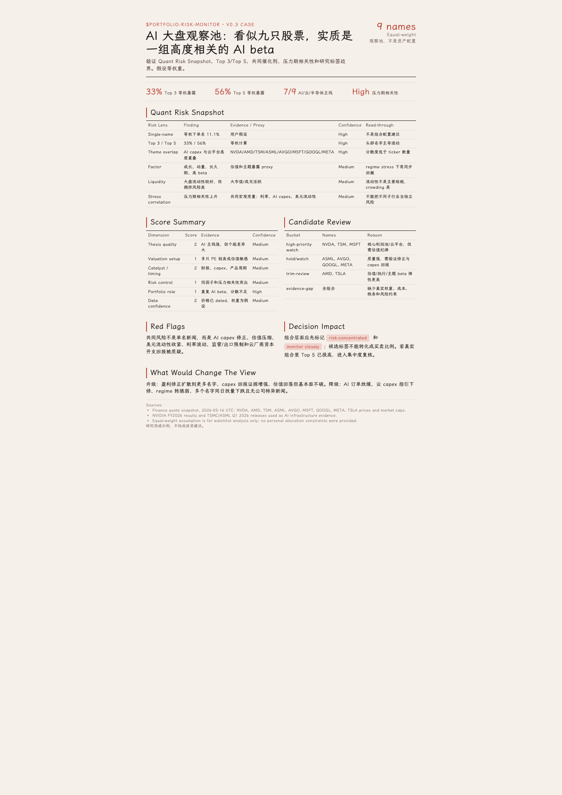

# MarketLens Skills

[中文文档](README.zh-CN.md)

MarketLens Skills is a publishable skill repository for AI-assisted public-market research.

Repository: https://github.com/taoquo/marketlens-skills

It provides five production-oriented skills:

| Skill | Purpose |
|---|---|
| `equity-research` | Equity research for US, Hong Kong, and A-share listed companies, covering quality scoring, earnings, fundamentals, valuation, moat, regional disclosures, red flags, and data freshness. |
| `market-regime-monitor` | Market regime monitoring across liquidity, sentiment, positioning, valuation crowding, scoring confidence, risk-budget impact, and cross-market risk transmission. |
| `sector-industry-research` | Sector and industry research across cycle stage, supply-demand, value chains, policy/technology shifts, peer structure, trade expression, and listed-company read-through. |
| `catalyst-event-monitor` | Event-driven research for upcoming catalysts, expectation gaps, market pricing, trade setup, scenario paths, pre-event watch data, and post-event thesis updates. |
| `portfolio-risk-monitor` | Portfolio and watchlist risk review across concentration, quantitative risk snapshots, exposures, priority ranking, drawdown scenarios, and rebalance watch signals. |

## Installation

Install from the open-source repository:

```bash
npx skills add https://github.com/taoquo/marketlens-skills --all
```

Or clone and link/copy the skill directories into a Codex project:

```bash
git clone https://github.com/taoquo/marketlens-skills.git
cd marketlens-skills

# Option A: symlink for local development
mkdir -p your-project/.codex/skills
ln -s "$PWD/equity-research" your-project/.codex/skills/equity-research
ln -s "$PWD/market-regime-monitor" your-project/.codex/skills/market-regime-monitor
ln -s "$PWD/sector-industry-research" your-project/.codex/skills/sector-industry-research
ln -s "$PWD/catalyst-event-monitor" your-project/.codex/skills/catalyst-event-monitor
ln -s "$PWD/portfolio-risk-monitor" your-project/.codex/skills/portfolio-risk-monitor

# Option B: copy for a standalone project
cp -R equity-research your-project/.codex/skills/
cp -R market-regime-monitor your-project/.codex/skills/
cp -R sector-industry-research your-project/.codex/skills/
cp -R catalyst-event-monitor your-project/.codex/skills/
cp -R portfolio-risk-monitor your-project/.codex/skills/
```

Build distributable `.skill` packages from a clone:

```bash
bash scripts/build-skills.sh
ls dist/*.skill
```

## Usage

Example prompts:

```text
Use $equity-research to analyze NVIDIA's latest annual results and valuation.
Use $equity-research to review Tencent's long-term quality and key risks.
Use $market-regime-monitor to assess whether the US equity market is crowded.
Use $market-regime-monitor to assess how current liquidity affects Hong Kong and A-share markets.
Use $sector-industry-research to analyze an industry cycle and key listed-company beneficiaries.
Use $sector-industry-research to compare an export manufacturing value chain across China and global peers.
Use $catalyst-event-monitor to map the next 12 weeks of events that could change a company's thesis.
Use $catalyst-event-monitor to review whether a product launch strengthened or weakened the thesis.
Use $portfolio-risk-monitor to review a watchlist for concentration, shared risk drivers, and priority names.
Use $portfolio-risk-monitor to identify which holdings belong in add-candidate, trim-review, or exit-review buckets.
```

## Data Freshness

All skills require:

- official and primary sources first;
- `as_of`, `published_at`, and `retrieved_at` timestamps when available;
- TTL-based freshness checks;
- cross-checking price-sensitive or regime-sensitive conclusions;
- marking missing data as unavailable instead of turning it into a directional signal.

## v0.2 Research Discipline

This release adds stricter conclusion gates:

- equity research must downgrade conclusions when price, filings, valuation inputs, or primary sources are missing;
- sector research must downgrade conclusions when industry scope, dated demand/supply evidence, peer set, or primary sources are missing;
- catalyst research must downgrade conclusions when event timing, source quality, expectation baseline, or post-event review criteria are missing;
- portfolio research must downgrade conclusions when holdings, weights/assumptions, price dates, or risk-driver evidence are missing;
- valuation work now includes sector-specific methods for financials, REITs, cyclicals, platforms, exporters, and pre-profit biotech;
- market regime calls now use indicator scoring, confidence levels, conflict handling, causal channels, and explicit view-change triggers.

## v0.3 Scoring And Trading Discipline

This release unifies the scoring and research-label system across all skills:

- shared scoring rules define 0-3 score direction, confidence, data quality, red-flag overrides, and allowed research labels;
- market-regime scores remain separate environment-pressure scores and are used to adjust risk-budget language, not to mechanically change company or portfolio totals;
- catalyst work now separates event importance from trade setup through consensus view, variant view, market-implied expectation, implied move, risk/reward read, invalidating evidence, and post-event review window;
- portfolio work now adds a lightweight quantitative risk snapshot covering concentration, top 3/top 5 exposure, factor/theme overlap, liquidity, stress correlation, and drawdown contribution;
- all score-based outputs include `Score Summary`, `Red Flags`, `Decision Impact`, and `What Would Change The View`;
- research can be reviewed through a calibration loop covering original score, evidence, 1-week/1-month/3-month outcomes, error attribution, and rule updates.

Use the full decision chain when multiple skills apply:

```text
Market Regime -> Sector / Industry Setup -> Company Quality And Valuation -> Catalyst / Timing -> Portfolio Role And Risk -> Research Label
```

## Examples

The `examples/` folder contains five Folio-typeset v0.3 validation cases, one per skill:

`equity-research` · NVIDIA long-term quality, valuation discipline, and research label separation.



`market-regime-monitor` · US technology-stock regime, liquidity/sentiment axes, and risk-budget impact.



`sector-industry-research` · AI server supply chain, profit pools, subsector scorecard, and trade expression.



`catalyst-event-monitor` · Apple WWDC26 event watch, expectation gap, and trade setup discipline.



`portfolio-risk-monitor` · Equal-weight AI watchlist, concentration, factor overlap, and stress-correlation risk.



These samples demonstrate the unified `Score Summary`, `Red Flags`, `Decision Impact`, and `What Would Change The View` blocks, plus catalyst trade setup and portfolio quantitative risk snapshots. They are output-format previews and do not constitute investment advice.

## Validation

```bash
bash scripts/validate-skills.sh
```

## Disclaimer

These skills are for research and educational use only. They do not provide personalized investment, legal, tax, or financial advice. Public-market investing involves risk, including loss of principal.
