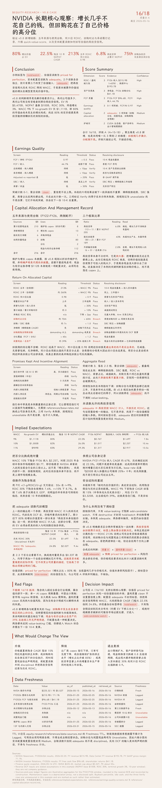
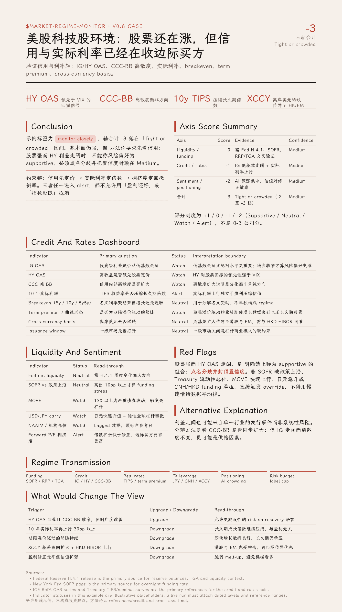
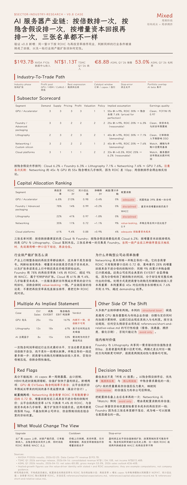
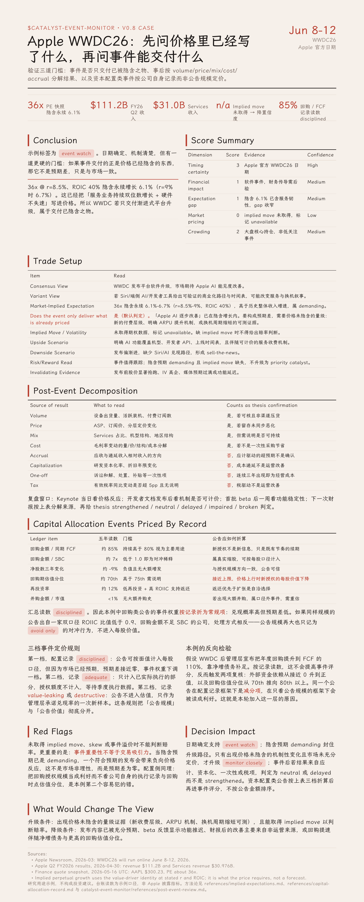
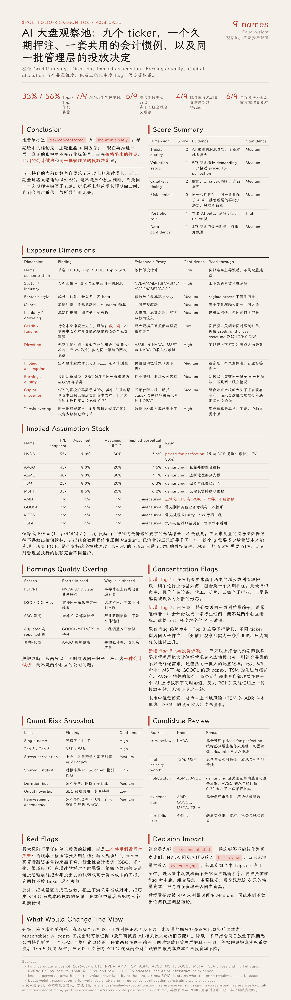
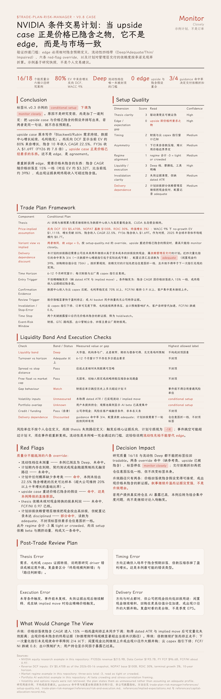

# MarketLens Skills

[中文文档](README.zh-CN.md)

MarketLens Skills is a publishable skill repository for AI-assisted public-market research.

Repository: https://github.com/taoquo/marketlens-skills

It provides six production-oriented skills:

| Skill | Purpose |
|---|---|
| `equity-research` | Equity research for US, Hong Kong, and A-share listed companies, covering quality scoring, earnings-quality screens, fundamentals, implied-expectation valuation, moat, regional disclosures, red flags, and data freshness. |
| `market-regime-monitor` | Market regime monitoring across liquidity, sentiment, positioning, valuation crowding, scoring confidence, risk-budget impact, and cross-market risk transmission. |
| `sector-industry-research` | Sector and industry research across cycle stage, supply-demand, value chains, policy/technology shifts, peer structure, trade expression, and listed-company read-through. |
| `catalyst-event-monitor` | Event-driven research for upcoming catalysts, expectation gaps, market pricing, trade setup, scenario paths, pre-event watch data, and post-event thesis updates. |
| `portfolio-risk-monitor` | Portfolio and watchlist risk review across concentration, quantitative risk snapshots, exposures, priority ranking, drawdown scenarios, and rebalance watch signals. |
| `trade-plan-risk-manager` | Converts market, sector, stock, catalyst, and portfolio research into non-personalized conditional trade plans with setup quality, risk triggers, execution checks, and post-trade review. |

## Installation

Install from the open-source repository:

```bash
npx skills add https://github.com/taoquo/marketlens-skills --all
```

Or clone and link/copy the skill directories into a Codex project. Every skill loads
shared rules through `../references/...`, so the top-level `references/` directory must sit
next to the skill directories:

```bash
git clone https://github.com/taoquo/marketlens-skills.git
cd marketlens-skills

mkdir -p your-project/.codex/skills

# Option A: symlink for local development
for skill in */SKILL.md; do
  ln -s "$PWD/${skill%/SKILL.md}" "your-project/.codex/skills/${skill%/SKILL.md}"
done
ln -s "$PWD/references" your-project/.codex/skills/references

# Option B: copy for a standalone project
for skill in */SKILL.md; do
  cp -R "${skill%/SKILL.md}" your-project/.codex/skills/
done
cp -R references your-project/.codex/skills/
```

Build distributable `.skill` packages from a clone:

```bash
bash scripts/build-skills.sh
ls dist/*.skill
```

## Usage

Example prompts:

```text
Use $equity-research to analyze NVIDIA's latest annual results and valuation.
Use $equity-research to review Tencent's long-term quality and key risks.
Use $market-regime-monitor to assess whether the US equity market is crowded.
Use $market-regime-monitor to assess how current liquidity affects Hong Kong and A-share markets.
Use $sector-industry-research to analyze an industry cycle and key listed-company beneficiaries.
Use $sector-industry-research to compare an export manufacturing value chain across China and global peers.
Use $catalyst-event-monitor to map the next 12 weeks of events that could change a company's thesis.
Use $catalyst-event-monitor to review whether a product launch strengthened or weakened the thesis.
Use $portfolio-risk-monitor to review a watchlist for concentration, shared risk drivers, and priority names.
Use $portfolio-risk-monitor to identify which holdings belong in add-candidate, trim-review, or exit-review buckets.
Use $trade-plan-risk-manager to convert a stock thesis into a conditional trade plan with entry, invalidation, risk unit, and review triggers.
Use $trade-plan-risk-manager to review whether a completed trade was a thesis error, timing error, risk framing error, or execution error.
```

## Data Discipline

`references/data-discipline.md` holds the rules every skill inherits. Each `SKILL.md`
adds only what is specific to its domain:

- official and primary sources first, under one shared three-tier evidence model;
- `as_of`, `published_at`, and `retrieved_at` recorded separately, never collapsed;
- a closed set of freshness grades: `Fresh`, `Lagged`, `Stale`, `Undated`, `Unavailable`;
- a core figure check with original wording, unit, period, cross-check, and one of four treatments;
- unit, currency, accounting-standard, and fiscal-calendar labelling before any cross-market comparison;
- user input classified as plan parameter, fact claim, or preference, with consistency checks before use;
- missing data marked unavailable and treated as a confidence limit, never as a directional signal.

Every skill also carries a degradation table mapping each missing or stale input to the
required handling, so a data gap changes the output in a defined way instead of being
noted and ignored.

A skill has no memory between sessions, so `references/review-and-calibration.md` defines
a `research-log/` append-only record. A call is written there when it is made, which is what
lets the 1-week, 1-month, and 3-month review cadence actually close. The directory is
gitignored and never created without asking first. The same file defines `Thesis Decay`: a
label that has not been reconfirmed is not intact by default, and price moving toward the
thesis without fundamental follow-through reduces confidence rather than raising it.

## Cross-Cutting Coverage

Six shared references are not owned by any one skill, because they change the
conclusion in more than one layer. `references/skill-routing.md` lists the trigger
for each:

- `references/implied-expectations.md` inverts the valuation question from what a company is worth to what its price requires. It splits enterprise value into the no-growth and growth components, runs a reverse DCF that solves for exactly one variable and translates it into an absolute quantity, reads each common multiple as an implied statement, and names what to solve for when a DCF does not fit the business model. Margin of safety is expressed as the distance between the implied assumption and the historical record, not as a discount to a computed fair value.
- `references/earnings-quality-screens.md` converts the qualitative red-flag list into computed ratios with thresholds. Cash conversion, accrual ratios, working-capital versus revenue growth, cost capitalization, and balance-sheet integrity are all computable from one filing plus the prior-year comparative. The breach count maps to a confidence cap and a label cap, and a sector table states which screens do not apply and what replaces them.
- `references/credit-and-cross-asset.md` treats equity as the junior claim. Market-level credit spreads, real yields, breakevens, term premium, and funding basis feed the regime read; maturity ladders, covenant headroom, and rating trajectory feed single-name work. For property, financials, capital-intensive, and pre-profit sectors, an equity conclusion without a credit read is capped rather than merely flagged.
- `references/base-rates.md` requires a reference class and its historical rate before any probability, likelihood word, or scenario weight. It covers approval rates, deal completion, guidance reliability, cycle duration, margin recovery, turnarounds, capacity cycles, and post-event drift, and keeps the unadjusted rate visible next to the adjusted estimate.
- `references/short-and-relative-value.md` adds the short side and the relative-value pair as first-class reads, so a confirmed red flag becomes a research object rather than only a confidence deduction. Short-side language requires verified borrow, float, and crowding data; without them the read stays `avoid only`.
- `references/capital-allocation-record.md` measures what management did with the cash. A five-year sources-and-uses ledger has to reconcile before any judgement is made, then twelve return screens measure what each destination earned: ROIIC on both a with-goodwill and an ex-goodwill basis over two windows, cumulative impairment against cumulative acquisition consideration, post-deal ROIC change, buyback timing as a percentile of the company own trading range, buyback spend against SBC, and net dilution. Seven further screens measure whether stated intentions were met, starting from the guidance hit rate and whether the incentive plan pays for capital efficiency at all. The aggregate read sets the reinvestment credit the valuation is allowed to take: historical ROIIC when `disciplined`, WACC when `adequate`, below WACC when `value-leaking`, and a no-growth anchor when `destructive`.

`references/skill-routing.md` also carries an `Out Of Scope` table. Crypto, standalone
FX, commodity futures, bond selection, options strategy, convertibles, private
companies, fund selection, portfolio optimization, tax and legal advice, ESG scoring,
intraday execution, and personal financial planning are outside coverage. Each row
names the in-scope adjacent read.

## Decision Chain

Each skill owns one layer of the research process. `references/skill-routing.md` holds
the ownership table, and `references/scoring-standard.md` holds the shared scoring and
research-label rules, the mapping from each layer to the shared labels, and the
binding chain constraints. When multiple skills apply, use the full chain:

```text
Market Regime -> Sector / Industry Setup -> Company Quality And Valuation -> Catalyst / Timing -> Portfolio Role And Risk -> Research Label -> Conditional Trade Plan And Risk Review
```

Release-by-release changes are tracked in [CHANGELOG.md](CHANGELOG.md).

## Examples

The `examples/` folder contains six Folio-typeset validation cases, rebuilt for v0.8 so that
each one exercises the release's gates: what the price implies, whether the reported earnings
survive the screens, where the cash actually went, and which label the answer is allowed to
carry. Each case ships as `.png` (previewed below, one continuous page), `.html`, and `.pdf`
(A4 pagination):

`equity-research` · NVIDIA at 16/18 quality across six dimensions, with a clean earnings read, an adequate capital-allocation record, and a reverse DCF where 80 percent of EV is growth.



`market-regime-monitor` · US technology-stock regime on three axes, where equities are still rising while credit and real rates already score negative, totalling -3 for tight or crowded.



`sector-industry-research` · AI server supply chain ranked three times, by multiple, by implied assumption, and by return on incremental capital, producing three different lists that overlap on one segment.



`catalyst-event-monitor` · Apple WWDC26, asking first whether the event only delivers what 36x already implies, then decomposing the result by source, and pricing buyback announcements by the company's own allocation record rather than by headline size.



`portfolio-risk-monitor` · Equal-weight AI watchlist where nine tickers resolve into one duration bet, one shared accounting practice, and one reinvestment dependence on the same set of management teams.



`trade-plan-risk-manager` · NVIDIA plan downgraded to monitor closely because the upside case restates what the price already requires, with liquidity measured as Deep and position intent discounted one notch for delivery dependence.



These samples demonstrate the mandatory `Red Flags`, `Decision Impact`, `What Would Change
The View`, `Data Freshness`, `Evidence Sources`, and `Disclaimer` blocks. Scored outputs add
a `Score Summary` table; `trade-plan-risk-manager` uses `Setup Quality` instead, as allowed by
`references/scoring-standard.md`. They are output-format previews and do not constitute
investment advice.

## Validation

```bash
# structure, frontmatter, reference routing, and required output blocks
bash scripts/validate-skills.sh

# rebuild packages, then require dist/*.skill to match the working tree byte for byte
bash scripts/build-skills.sh
REQUIRE_DIST=1 bash scripts/validate-skills.sh
```

Skills are discovered from the directory layout, so a new skill needs no script or CI
edit. GitHub Actions runs the same three commands on every push and pull request.

## Disclaimer

These skills are for research and educational use only. They do not provide personalized investment, legal, tax, or financial advice. Public-market investing involves risk, including loss of principal.
