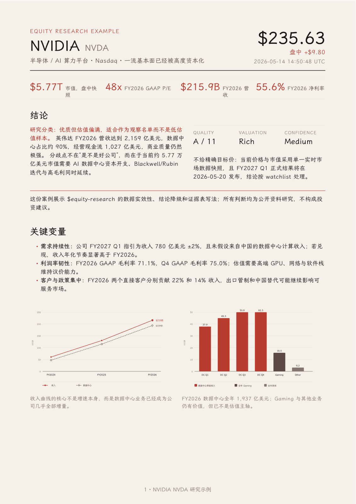

# MarketLens Skills

[English](README.md)

MarketLens Skills 是一个可发布的金融投研 Skill 仓库，用于 AI 辅助公开市场研究。

仓库地址：https://github.com/taoquo/marketlens-skills

当前包含两个面向生产使用的 Skill：

| Skill | 用途 |
|---|---|
| `equity-research` | 覆盖美股、港股、A股的个股研究，包含财报、基本面、估值、护城河、区域披露规则、风险信号和数据实效性。 |
| `market-regime-monitor` | 市场环境判断，覆盖流动性、情绪、仓位、估值拥挤度、置信度评分和跨市场风险传导。 |

## 安装

从开源仓库安装：

```bash
npx skills add https://github.com/taoquo/marketlens-skills --all
```

或者克隆仓库后，把 skill 软链接/复制到 Codex 项目：

```bash
git clone https://github.com/taoquo/marketlens-skills.git
cd marketlens-skills

# 方式 A：本地开发时使用软链接
mkdir -p your-project/.codex/skills
ln -s "$PWD/equity-research" your-project/.codex/skills/equity-research
ln -s "$PWD/market-regime-monitor" your-project/.codex/skills/market-regime-monitor

# 方式 B：复制到独立项目
cp -R equity-research your-project/.codex/skills/
cp -R market-regime-monitor your-project/.codex/skills/
```

从克隆仓库构建可分发 `.skill` 包：

```bash
bash scripts/build-skills.sh
ls dist/*.skill
```

## 使用示例

```text
Use $equity-research 分析英伟达最新年度财报和估值。
Use $equity-research 分析腾讯控股的长期质量和关键风险。
Use $market-regime-monitor 现在美股市场是不是太拥挤。
Use $market-regime-monitor 当前流动性对港股/A股影响如何。
```

## 数据实效性

两个 Skill 都要求：

- 优先使用官方源和一手来源；
- 尽量记录 `as_of`、`published_at`、`retrieved_at`；
- 按 TTL 判断数据是否过期；
- 对价格敏感或市场状态敏感的结论做交叉验证；
- 缺失数据只能标记为 unavailable，不得硬转成看多或看空信号。

## v0.2 研究纪律

本版本加入更严格的结论门槛：

- 个股研究在价格、财报、估值输入或一手来源不足时，必须降级结论；
- 估值框架扩展到金融、REIT、周期股、平台互联网、出口制造和 pre-profit biotech 等行业；
- 市场环境判断加入指标打分、置信度、冲突处理、传导机制和反证触发条件。

## 示例

`examples/` 目录包含一个使用 `$equity-research` 生成、并用 Folio 排版的英伟达个股研究预览：



该案例展示数据日期、实效性表、结论门槛不足时的降级处理，以及研究用途免责声明。它只用于展示输出预览，不构成投资建议。

## 校验

```bash
bash scripts/validate-skills.sh
```

## 免责声明

本仓库 Skill 仅用于研究和教育参考，不提供个性化投资、法律、税务或财务建议。公开市场投资存在风险，可能损失本金。
