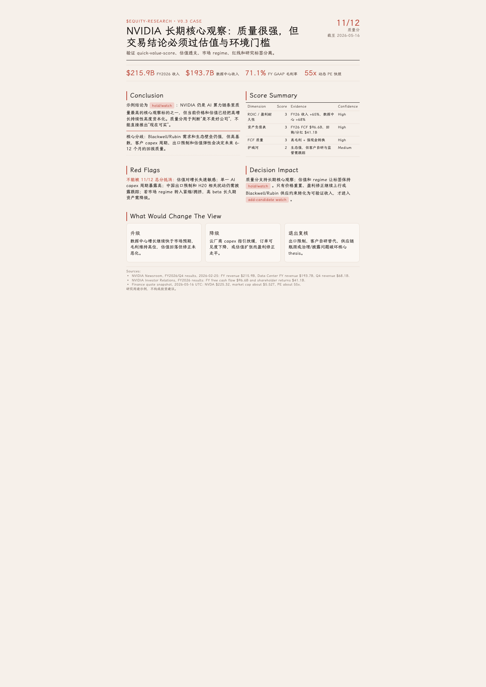
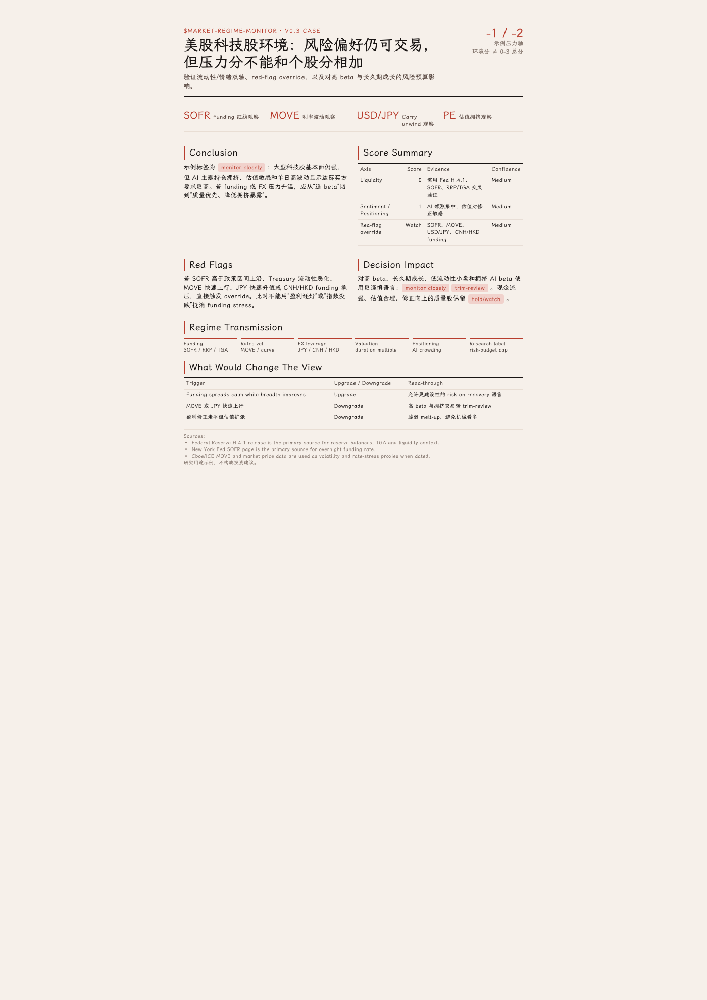
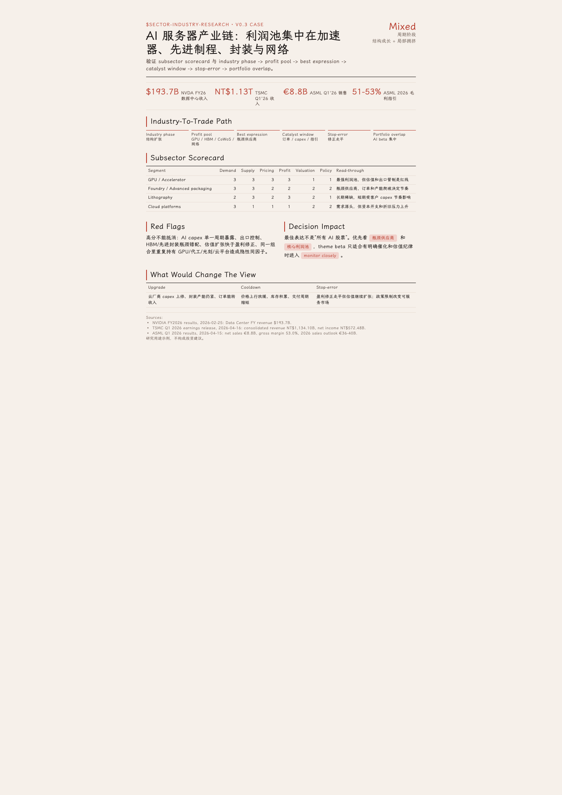
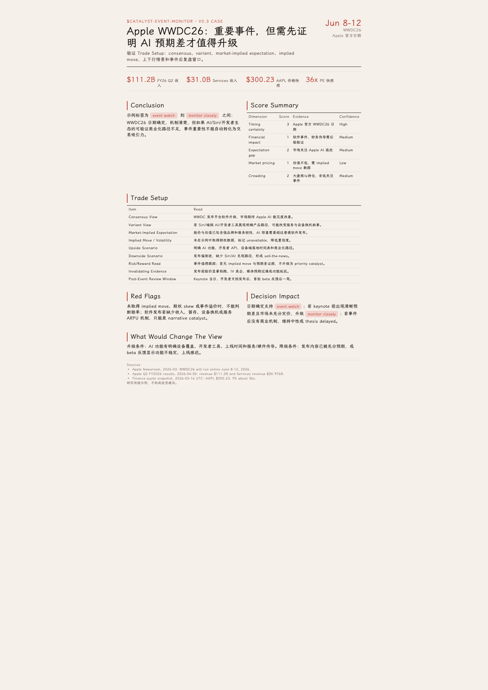
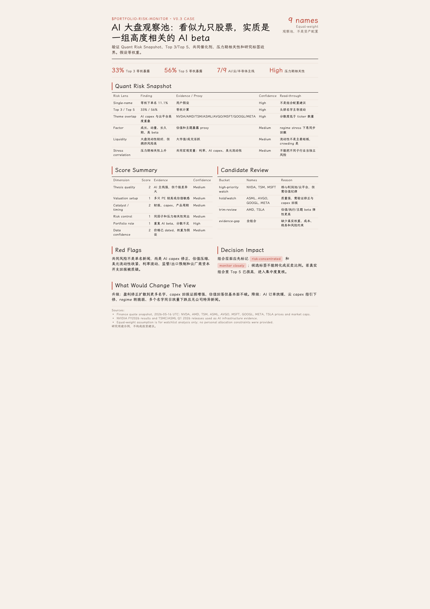
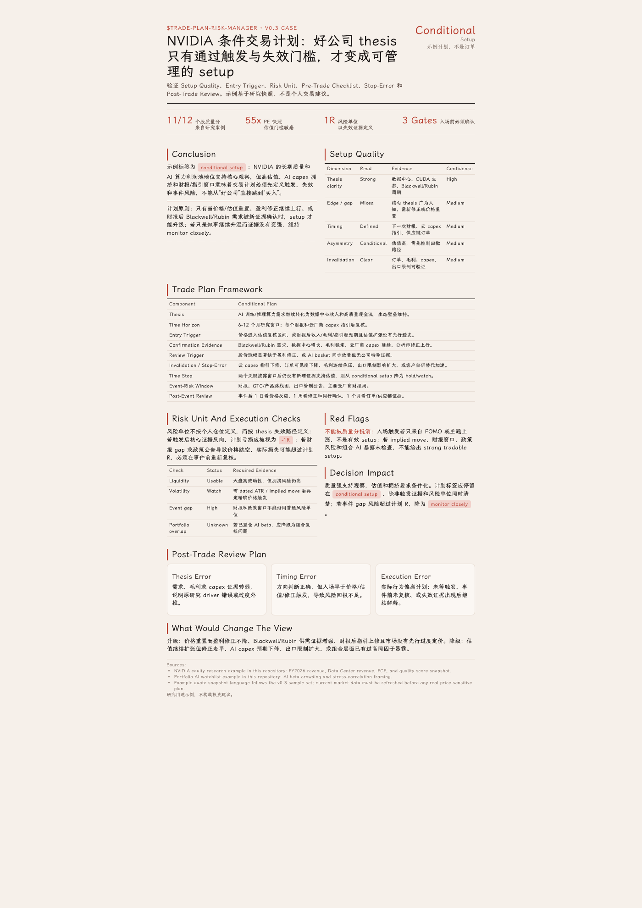

# MarketLens Skills

[English](README.md)

MarketLens Skills 是一个可发布的金融投研 Skill 仓库，用于 AI 辅助公开市场研究。

仓库地址：https://github.com/taoquo/marketlens-skills

当前包含六个面向生产使用的 Skill：

| Skill | 用途 |
|---|---|
| `equity-research` | 覆盖美股、港股、A股的个股研究，包含质量评分、财报、基本面、估值、护城河、区域披露规则、风险信号和数据实效性。 |
| `market-regime-monitor` | 市场环境判断，覆盖流动性、情绪、仓位、估值拥挤度、置信度评分、风险预算影响和跨市场风险传导。 |
| `sector-industry-research` | 行业与产业链研究，覆盖周期位置、供需、库存、价格、产能、利润池、政策/技术变化、交易表达、同业比较和上市公司映射。 |
| `catalyst-event-monitor` | 事件驱动研究，覆盖未来催化、预期差、市场定价、交易设定、情景路径、事件前观察数据和事件后 thesis 更新。 |
| `portfolio-risk-monitor` | 组合与观察池风险体检，覆盖集中度、轻量量化风险快照、风险暴露、优先级排序、回撤情景和再平衡观察信号。 |
| `trade-plan-risk-manager` | 将市场、行业、个股、催化剂和组合研究转成非个性化的条件交易计划，覆盖设定质量、风险触发、执行检查和交易后复盘。 |

## 安装

从开源仓库安装：

```bash
npx skills add https://github.com/taoquo/marketlens-skills --all
```

或者克隆仓库后，把 skill 软链接/复制到 Codex 项目。每个 skill 通过 `../references/...` 读取共享
规范，因此顶层 `references/` 目录必须和各 skill 目录放在同一层：

```bash
git clone https://github.com/taoquo/marketlens-skills.git
cd marketlens-skills

mkdir -p your-project/.codex/skills

# 方式 A：本地开发时使用软链接
for skill in */SKILL.md; do
  ln -s "$PWD/${skill%/SKILL.md}" "your-project/.codex/skills/${skill%/SKILL.md}"
done
ln -s "$PWD/references" your-project/.codex/skills/references

# 方式 B：复制到独立项目
for skill in */SKILL.md; do
  cp -R "${skill%/SKILL.md}" your-project/.codex/skills/
done
cp -R references your-project/.codex/skills/
```

从克隆仓库构建可分发 `.skill` 包：

```bash
bash scripts/build-skills.sh
ls dist/*.skill
```

## 使用示例

```text
Use $equity-research 分析英伟达最新年度财报和估值。
Use $equity-research 分析腾讯控股的长期质量和关键风险。
Use $market-regime-monitor 现在美股市场是不是太拥挤。
Use $market-regime-monitor 当前流动性对港股/A股影响如何。
Use $sector-industry-research 分析某个行业周期和关键上市公司受益方向。
Use $sector-industry-research 比较中国和全球出口制造产业链的利润池变化。
Use $catalyst-event-monitor 梳理某家公司未来 12 周可能改变 thesis 的事件。
Use $catalyst-event-monitor 复盘一次产品发布是否强化或削弱了原 thesis。
Use $portfolio-risk-monitor 检查观察池的集中度、共同风险因子和优先级。
Use $portfolio-risk-monitor 判断哪些持仓应进入加仓候选、减仓复核或退出复核观察桶。
Use $trade-plan-risk-manager 把一个个股 thesis 转成包含入场、失效、风险单位和复核触发的条件交易计划。
Use $trade-plan-risk-manager 复盘一笔交易属于 thesis 错误、时机错误、风险框架错误还是执行错误。
```

## 数据纪律

`references/data-discipline.md` 存放所有 skill 共用的数据规则，各份 `SKILL.md`
只补充自己领域特有的部分：

- 优先使用官方源和一手来源，全仓统一的三级证据模型；
- `as_of`、`published_at`、`retrieved_at` 分开记录，不得合并成一个日期；
- 封闭枚举的时效等级：`Fresh`、`Lagged`、`Stale`、`Undated`、`Unavailable`；
- 核心数字校验表：原文措词、单位、期间、交叉核对，以及四种处理方式之一；
- 跳市场对比前必须标注单位、币种、会计准则和财年口径；
- 用户输入分为计划参数、事实声明、偏好三类，使用前先跑一致性检查；
- 缺失数据标记为 unavailable 并当作置信度上限，不得硬转成看多或看空信号。

每个 skill 还各自带一张降级矩阵，把“缺失或过期的输入”映射到“必须采取的处理方式”，
让数据缺口以确定方式改变输出，而不是写一句备注就过。

skill 在不同会话之间没有记忆，所以 `references/review-and-calibration.md` 定义了
`research-log/` 追加式记录：下结论时就写入日志，1 周 / 1 个月 / 3 个月的复盘
节奏才能真正闭环。该目录已 gitignore，首次创建前必须先询问用户。

## 决策链

每个 skill 负责研究流程中的一层。归属划分见 `references/skill-routing.md`。
`references/scoring-standard.md` 存放共享评分规则、各层领域读数到九个共用标签的映射，
以及具有约束力的决策链限制。多个 skill 同时适用时，按完整决策链处理：

```text
市场环境 -> 行业/产业设置 -> 公司质量与估值 -> 催化剂/时机 -> 组合角色与风险 -> 研究标签 -> 条件交易计划与风险复核
```

各版本改动记录见 [CHANGELOG.md](CHANGELOG.md)。

## 示例

`examples/` 目录包含 6 个使用 Folio 排版的验证案例，每个案例都提供 `.png`（下方预览）、`.html`
和 `.pdf` 三种格式：

`equity-research` · NVIDIA 长期质量、估值纪律和研究标签分离。



`market-regime-monitor` · 美股科技股市场环境、流动性/情绪双轴和风险预算影响。



`sector-industry-research` · AI 服务器产业链、利润池、子行业评分和交易表达。



`catalyst-event-monitor` · Apple WWDC26 事件观察、预期差和交易设定纪律。



`portfolio-risk-monitor` · 等权 AI 观察池、集中度、因子重叠和压力期相关性风险。



`trade-plan-risk-manager` · NVIDIA 条件交易计划、设定质量、风险单位框架、执行检查和交易后复盘。



这些案例展示强制输出块 `Red Flags`、`Decision Impact`、`What Would Change The View`、`Data
Freshness`、`Evidence Sources` 和 `Disclaimer`。带评分的输出额外包含 `Score Summary` 表；
`trade-plan-risk-manager` 按 `references/scoring-standard.md` 的例外规则改用 `Setup Quality`。
它们只用于展示输出预览，不构成投资建议。

## 校验

```bash
# 校验目录结构、frontmatter、reference 路由和必需输出块
bash scripts/validate-skills.sh

# 重新打包，并要求 dist/*.skill 与工作区逐字节一致
bash scripts/build-skills.sh
REQUIRE_DIST=1 bash scripts/validate-skills.sh
```

脚本按目录结构自动发现 skill，新增 skill 无需改脚本或 CI。GitHub Actions 在每次 push 和
pull request 上执行同样的三条命令。

## 免责声明

本仓库 Skill 仅用于研究和教育参考，不提供个性化投资、法律、税务或财务建议。公开市场投资存在风险，可能损失本金。
